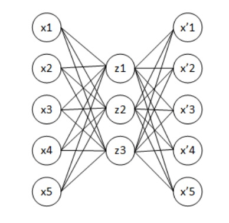
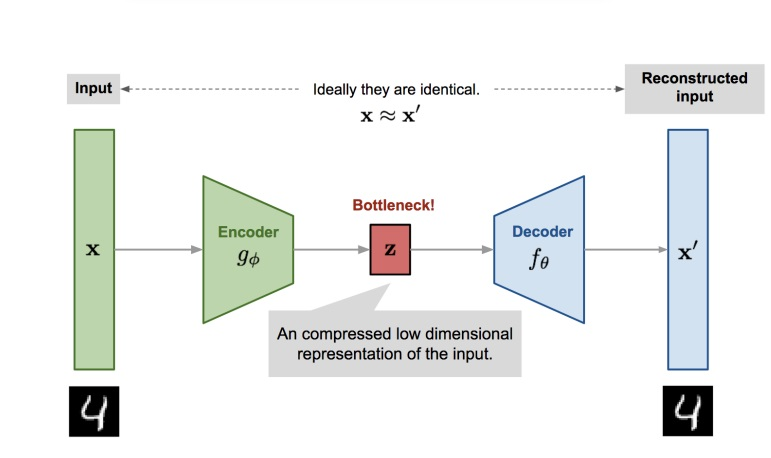
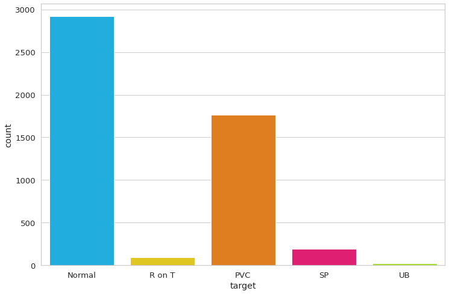
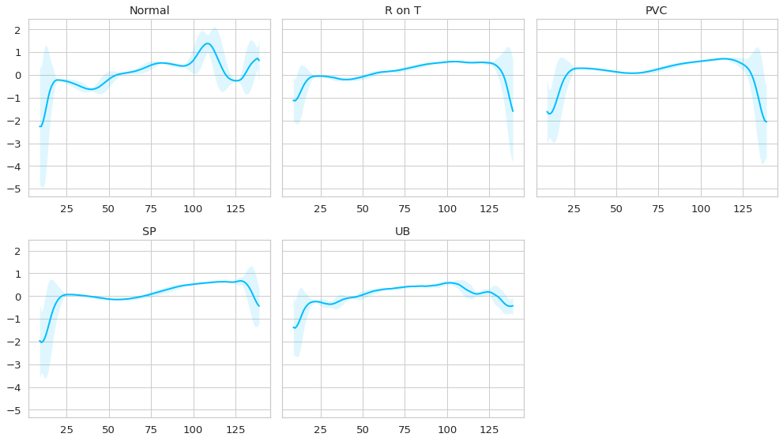
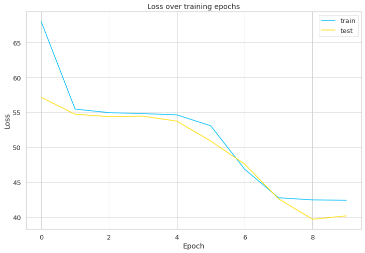
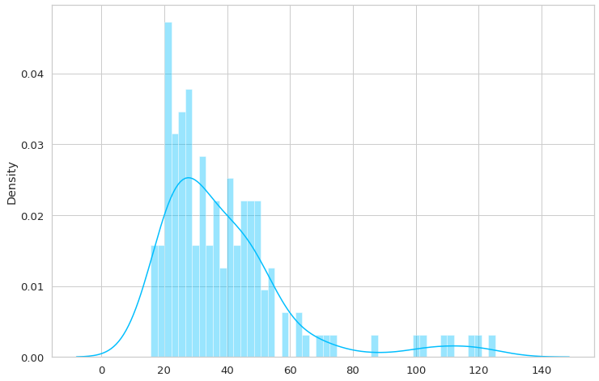
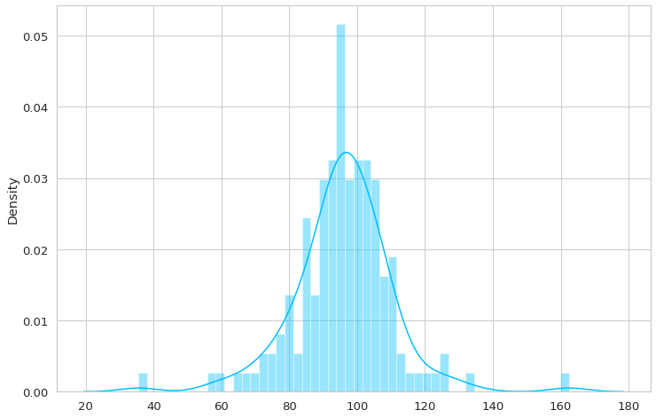
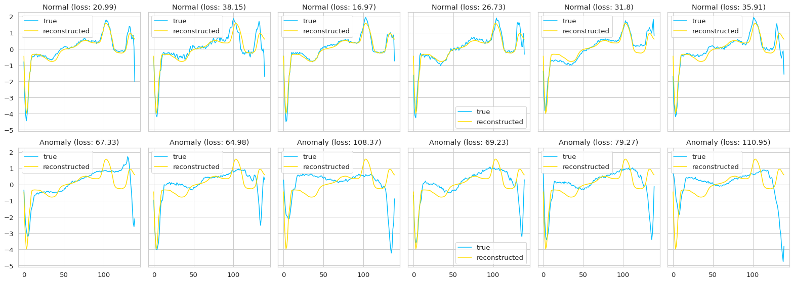

  <h1>Heart-Rhythm</h1>
  <h3>Concept</h3>
  Identify abnormalities from corrupted heartbeat time series.

  <h3> Description of the data used </h3>
  An electrocardiogram is a test that checks how your heart is working,
  by measuring the electrical activity of your heart. With each heartbeat an electrical
  impulse (or wave) passes through your heart. This wave causes the muscle
  to contract and pump blood out of your heart.
  <ul>
    We have 5 types of heartbeat (classes):
    <li>Normal (H)</li>
    <li>R-on-T Premature ventricular contraction (R-on-T PVC)</li>
    <li>Premature ventricular contraction (PVC)</li>
    <li>Supraventricular premature or ectopic extrasystole (SP or EB)</li>
    <li>Unclassified rhythm (UB).</li>
  </ul>
  When the heart is healthy and has a typical frequency of 70 to 75 beats per minute, each
  cardiac cycle or heartbeat takes about 0.8 seconds to complete.

  <h3> Description of the neural network architecture </h3>
  Autoencoder - is a special achitecture for artificial neural networks that allows to apply unsupervised learning using back propagation method.
  The simplest autoencoder model is a forward propagation? non-feedback network most similar to a perceptron, containing an input layer, hidden layer and output. 
  In contrast to a perceptron, the output layer should contain the same number of neurons as the input layer.
  
  The basic principle of operating and traing an autoencoder network is to obtain the response in the output layer closest to the input layer. 
  In order to ensure that the solution odes not turn out to be trivial, restrictions are imposed on the hidden layer:
  Hidden layer must be smaller than input|output layer or arcitificially limits the number of simultaneously active neurons - sparse activation.
  These constraints force the NN searches for generalisations and correlations in the input data, performs compressing on them.
  In this way, NN is automatically trained to excract common features from input data which are encoded in the values of NN weights.
  Autoencoders only try to learn the most important features (a compressed version) of the data.

  I will use a pair of LSTM layers - a long chain of short-term memory to capture the temporal dependencies of the data. Unlike tradicional RNN, a LSTM network is well adapted to be trained on tasks of classfication, processing and prediction time series
  when important events are separated by time lags with uncertain duration and boundaries.
  Relative immunity to the duration of time gaps gives LSTM an advantage over RNN, hidden Markov models na d other training methods for sequences in a variety of applications

  
  <h3> Preparation for training </h3>

  <ul>
    Required libs:
    <li>numpy</li>
    <li>pandas</li>
    <li>seaborn</li>
    <li>torch</li>
    <li>matplotlib</li>
    <li>train_test_split (sklearn)</li>
    <li>a2p arff2pandas</li>
    <li>rcParams (pylab)</li>
  </ul>

  <h3> Preprocessing </h3>

  <h3>Data</h3>
  <ul>
    <li>Train: 2.5k samples</li>
    <li>Val: 294 samples</li>
    <li>Test: 145 samples</li>
    <li>Experiment: 2081 samples</li>
  </ul>
  <b>Dataframe distribution by class</b>
   
  An infographic of the averaged time series for each class heartbeat.
  
  The graphs show that the largest number of examples are Normal heartbeat.
  The behaviour of the "Normal" class is different from the others, which gives the possibility to train model on the loaded data.
  We put the "Normal" class in a separate dataframe and the other classes go to dataframe for anomalies.
  An additional function for formatting datasets is introduced. This is necessary
  to use the datasets as tensors when training the auto encoder.
  Each time series will be converted into a two-dimensional tensor (length
  of sequence X number of features)

  <h3>Training</h3>
  <ul>
    <li><b>Optimizer</b>: Adam</li>
    <li><b>Loss</b>: L1</li>
    <li><b>epochs</b>: 10</li>
  </ul>
  Loss function
  
  Minimises L1Loss, which measures the average absolute error. As with the RMS error the reconstructed data does not give this picture.

  <h3>  Experiments </h3>
  Using the threshold value = 26, the problem of already binary classification is solved.
  If the reconstruction loss for the example is below the threshold value, it isis classified as a normal heartbeat. Otherwise it is classified as
  an abnormality.
  
  Checks the quality of the normal heartbeat model.
  The class "Normal" is used
  <b>Correct normal predictions: 43/14</b>
  Now run the model prediction on a new subset of the "anomaly" dataframe
  
  <b>Correct anomaly predictions 145/145</b>
  All abnormal heart rhythms have been detected correctly. The setting of the threshold is highly dependent on the number of learning epochs.
  

  <h3> Code & Data </h3>
  <ul> <b> bert based </b>
    <li>Code is stored in notebook</li>
    <li>Splits download in notebook </li>
  </ul>
